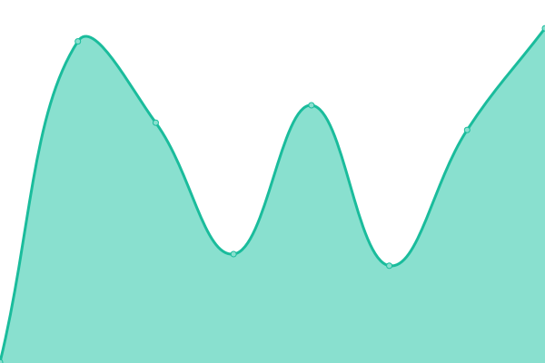
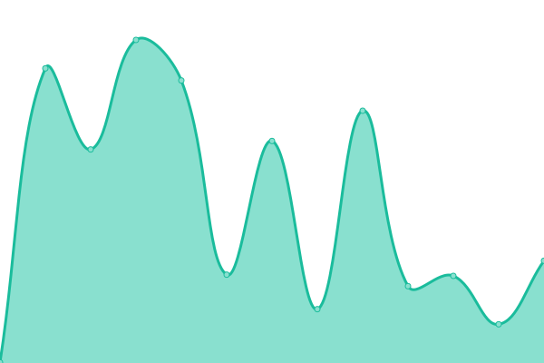
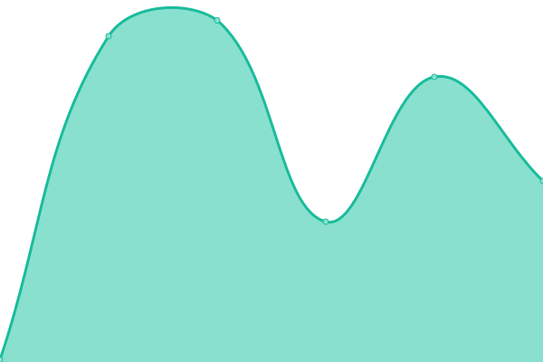
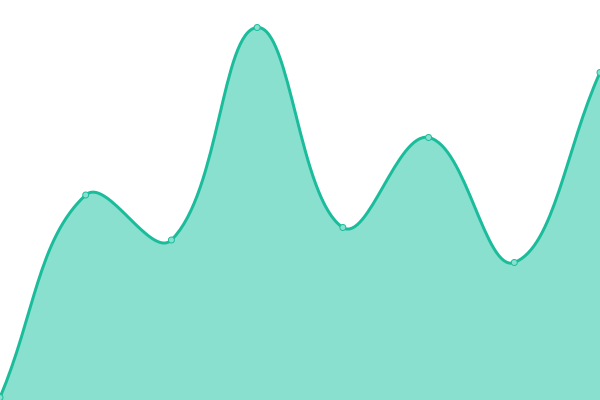
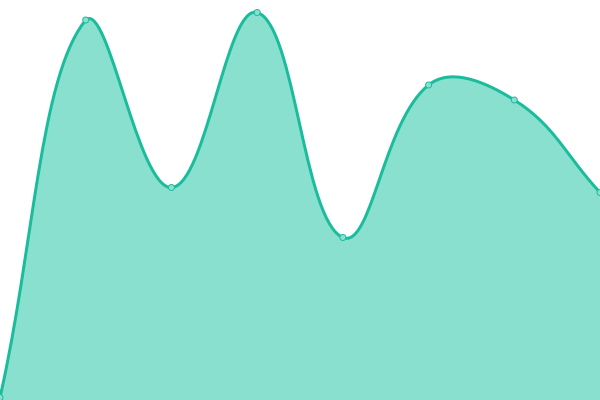
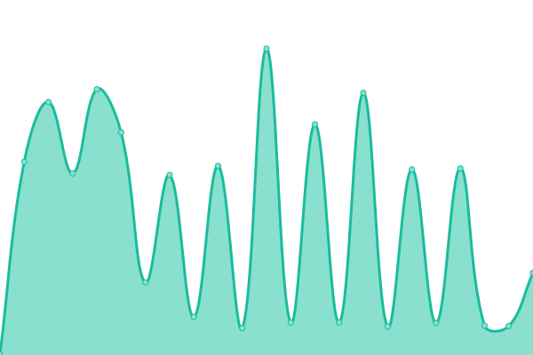

# [📈 Live Status](https://status.agungdev.com): <!--live status--> **🟧 Partial outage**

This repository contains the open-source uptime monitor and status page for [Anakagung2009-bit](https://status.agungdev.com), powered by [Upptime](https://github.com/upptime/upptime).

With [Upptime](https://upptime.js.org), you can get your own unlimited and free uptime monitor and status page, powered entirely by a GitHub repository. We use [Issues](https://github.com/Anakagung2009-bit/agungdevserverstatus/issues) as incident reports, [Actions](https://github.com/Anakagung2009-bit/agungdevserverstatus/actions) as uptime monitors, and [Pages](https://status.agungdev.com) for the status page.

<!--start: status pages-->
<!-- This summary is generated by Upptime (https://github.com/upptime/upptime) -->
<!-- Do not edit this manually, your changes will be overwritten -->
<!-- prettier-ignore -->
| URL | Status | History | Response Time | Uptime |
| --- | ------ | ------- | ------------- | ------ |
|  [Agung Dev](https://agungdev.com) | 🟩 Up | [agung-dev.yml](https://github.com/Anakagung2009-bit/agungdevserverstatus/commits/HEAD/history/agung-dev.yml) | 

 362ms
     
 | 

<a href="https://status.agungdev.com/history/agung-dev">92.76%</a>
    

|  [Agung News](https://news.agungdev.com) | 🟩 Up | [agung-news.yml](https://github.com/Anakagung2009-bit/agungdevserverstatus/commits/HEAD/history/agung-news.yml) | 

 150ms
     
 | 

<a href="https://status.agungdev.com/history/agung-news">92.76%</a>
    

|  [Agung Meet](https://meet.agungdev.com) | 🟥 Down | [agung-meet.yml](https://github.com/Anakagung2009-bit/agungdevserverstatus/commits/HEAD/history/agung-meet.yml) | 

 2684ms
     
 | 

<a href="https://status.agungdev.com/history/agung-meet">0.00%</a>
    

|  [Agung Imagen AI](https://imagen.agungdev.com) | 🟩 Up | [agung-imagen-ai.yml](https://github.com/Anakagung2009-bit/agungdevserverstatus/commits/HEAD/history/agung-imagen-ai.yml) | 

 797ms
     
 | 

<a href="https://status.agungdev.com/history/agung-imagen-ai">99.72%</a>
    

|  [Agung Auth](https://api.agungdev.com) | 🟩 Up | [agung-auth.yml](https://github.com/Anakagung2009-bit/agungdevserverstatus/commits/HEAD/history/agung-auth.yml) | 

 149ms
     
 | 

<a href="https://status.agungdev.com/history/agung-auth">100.00%</a>
    

|  [Agung Chat AI](https://chatai.agungdev.com) | 🟩 Up | [agung-chat-ai.yml](https://github.com/Anakagung2009-bit/agungdevserverstatus/commits/HEAD/history/agung-chat-ai.yml) | 

 1251ms
     
 | 

<a href="https://status.agungdev.com/history/agung-chat-ai">92.44%</a>
    

|  [Agung Account](https://account.agungdev.com) | 🟩 Up | [agung-account.yml](https://github.com/Anakagung2009-bit/agungdevserverstatus/commits/HEAD/history/agung-account.yml) | 

 88ms
     
 | 

<a href="https://status.agungdev.com/history/agung-account">100.00%</a>
    

|  [Agung Dev Assets](https://assets.agungdev.com) | 🟥 Down | [agung-dev-assets.yml](https://github.com/Anakagung2009-bit/agungdevserverstatus/commits/HEAD/history/agung-dev-assets.yml) | 

 80ms
     
 | 

<a href="https://status.agungdev.com/history/agung-dev-assets">0.00%</a>
    

|  [Agung Dev Download](https://dl.agungdev.com) | 🟥 Down | [agung-dev-download.yml](https://github.com/Anakagung2009-bit/agungdevserverstatus/commits/HEAD/history/agung-dev-download.yml) | 

 69ms
     
 | 

<a href="https://status.agungdev.com/history/agung-dev-download">0.00%</a>
    

|  [Agung Weather](https://weather.agungdev.com) | 🟩 Up | [agung-weather.yml](https://github.com/Anakagung2009-bit/agungdevserverstatus/commits/HEAD/history/agung-weather.yml) | 

 151ms
     
 | 

<a href="https://status.agungdev.com/history/agung-weather">93.10%</a>
    

|  [Agung Tasks](https://tasks.agungdev.com) | 🟩 Up | [agung-tasks.yml](https://github.com/Anakagung2009-bit/agungdevserverstatus/commits/HEAD/history/agung-tasks.yml) | 

 128ms
     
 | 

<a href="https://status.agungdev.com/history/agung-tasks">92.69%</a>
    

<!--end: status pages-->

[**Visit our status website →**](https://status.agungdev.com)

## 📄 License

- Powered by: [Upptime](https://github.com/upptime/upptime)
- Code: [MIT](./LICENSE) © [Anand Chowdhary](https://anandchowdhary.com), supported by [Pabio](https://pabio.com)
- Data in the `./history` directory: [Open Database License](https://opendatacommons.org/licenses/odbl/1-0/)
